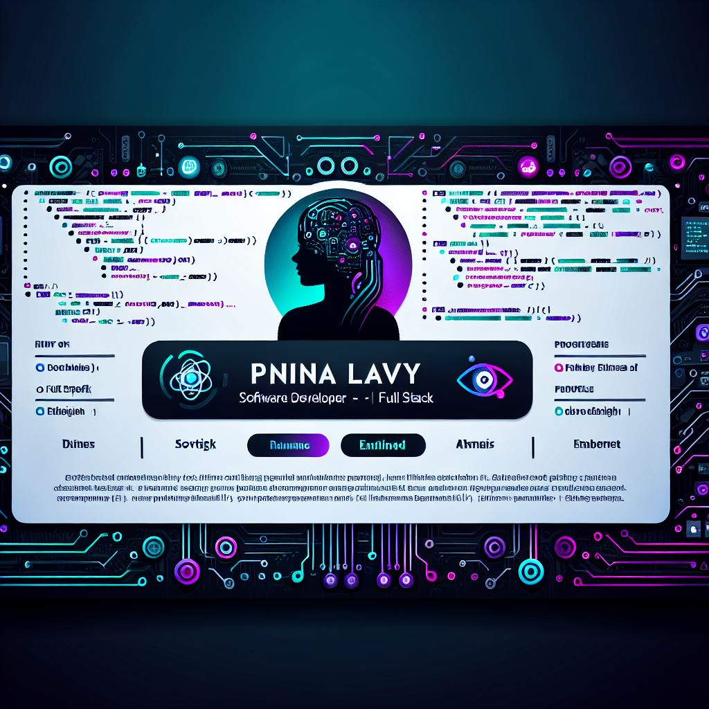

  

# 👋 Hi, I'm Pnina Lavy

I'm a Software Engineer and Practical Software Developer, graduate of a two-year diploma program specializing in Embedded Systems, Full Stack Development, and AI Foundations. Currently interning at Amdocs in the IOSS department, where I work on developing GenAI-based models.

---

## 🛠️ Technologies I Work With:
- Programming Languages: C#, Java, C++, Python, JavaScript, Assembly
- Web Technologies: React, Angular, Node.js, HTML5, CSS
- Databases: SQL Server, MongoDB, MySQL, Access
- Tools & Environments: Visual Studio, VS Code, IntelliJ, Git, GitLab, AWS

---

## 💡 Selected Projects:
- **Smart Carpooling System** – Built with .NET Core and React, integrated with OpenStreetMap and SendGrid APIs.
- **Interactive Game** – Developed an immersive game using JavaScript, HTML, and CSS.

---

## 📚 Education:
- Practical Software Engineering Diploma (2022–2025) – MI Technological Training Institute
- Advanced courses through KAMATECH's Extra-Code Program

---

## 📫 Contact Me:
- 📧 7630617@gmail.com
- 💼 [GitHub](https://github.com/pninilavy) 

---

## 📊 GitHub Stats:

